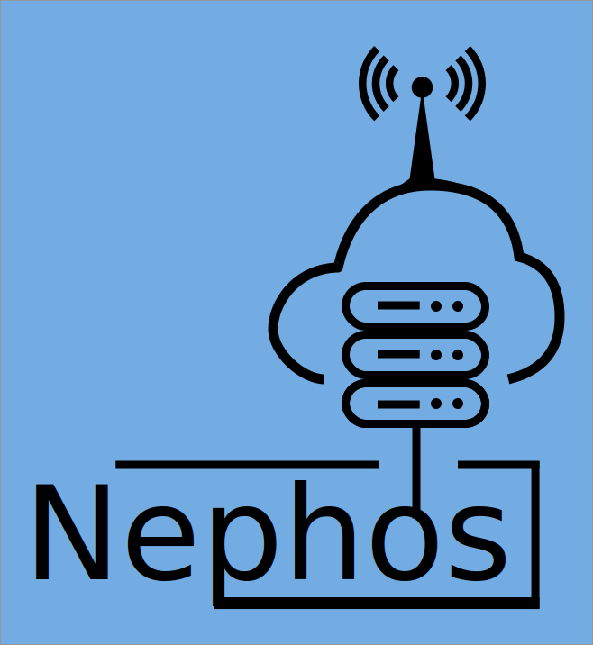

# Project Nephos  
Google Summer Of Code 2018 () Project under CCExtractor; Project Nephos

#    

## Abstract
Project Nephos aims at simplifying the process of moving samples from local storage to cloud for Universities by automating, almost, all the steps involved. It consists of three independent modules; recording module, processing module, and uploading module.

The recording module is responsible for managing the addition of channel lists, set up of recording jobs and saving the recorded streams. The processing module parses saved samples, associates tags, extracts subtitles and converts the video files to MP4 to reduce the file size. The uploading module uploads the processed stream files, and also shares samples with other universities if required.

Nephos is developed, using Python and few other open source projects. To accomplish all the above mentioned tasks with cent-percent reliability and zero failures (unless wrong data is input, which gets logged), testing and logging is an integral part of Nephos development and running cycle, respectively.

[Project Link](https://summerofcode.withgoogle.com/projects/#5889497431015424)

***
## Installation (And Setup)
1. Nephos requires following environment dependencies:
    - Python 3
    - Pip
    - pipenv
2. Nephos requires following third party libraries:
    - FFmpeg and FFprobe
    - Multicat
    - CCExtractor (requires tesseract-ocr-dev and leptonica-dev)
<!-- 1. 1) [Install Python3](https://kerneltalks.com/tools/install-python-3-on-linux-redhat-centos-ubuntu/)  -->
   <!-- 2) [Install Pip](https://www.tecmint.com/install-pip-in-linux/)  -->
<!-- 2. 1) [Install FFMPEG and FFPROBE](https://www.vultr.com/docs/how-to-install-ffmpeg-on-centos)  -->
   <!-- 2) [Install CCExtractor](https://github.com/CCExtractor/ccextractor/wiki/Installation)  -->
   <!-- 3) [Install Multicat](https://github.com/mmalecki/multicat/blob/master/trunk/INSTALL)  -->
3. 1) Nephos uses `mail` client to send email notifications, please [configure](https://superuser.com/questions/351841/how-do-i-set-up-the-unix-mail-command) it before running Nephos.
   2) You'll be asked to enter the email address(es) of recipient(s) of critical mails
at initialisation of Nephos. It is only asked on first launch, to edit it
later:
        - Go to Nephos directory, default is $HOME/Nephos
        - Edit the hidden file ".critical_mail_addrs", multiple addresses separated by
  a single whitespace
        - Restart Nephos after editing the file
        - In case of any email address fails at RegEx match, it'll be listed in info
  logs, ignored by config handler and you can correct it in the same file

### Install Using Git Clone
4. 1) Clone the repository, `git clone https://github.com/thealphadollar/nephos.git && cd nephos` 
   2) Run the script, `sudo ./install.sh`  The script will install all the aforementioned system dependencies and python libraries for Nephos. 
   NOTE: Running `pip3 install .` Will automatically determine your distribution and install the dependencies for you
5. 1) Observe and modify configurations available in `$HOME/Nephos/config` (**especially maintenance and module configurations, and processing script**) 
        - Update path to various libraries, in the config file, being used; **fatal error might error** in case where the path to binaries (soft links work) is not appropriate.
   2) Add `nephos_start.sh` as [a cron job to be executed at startup](https://www.cyberciti.biz/faq/linux-execute-cron-job-after-system-reboot/) in `root` crontab. 
        `@restart /path/to/nephos_start.sh 2&> ~/Nephos/boot_start.log`
   3) Run nephos using `sudo ./nephos_start.sh`. This command runs `Nephos` under a new `screen` session. Press `ctrl + a` and then 'd' to detach from the session while it keeps running in the background.

## To Add Channels And Jobs
Please go to [Nephos Config](https://github.com/thealphadollar/NephosConfig) repository to modify the channels, jobs and share lists that Nephos works on.

## Running the Web Interface
Nephos has a Web Interface that you can see how everything works. To get started set the enviorment `FLASK_APP` to the path where webServer.py is and run it with `flask run` and you can see the database entries in an instant!

Currently the web app offers for you to see which channels are jobs in the database and can be accessed by visiting the url flask provides with the following paths: `/channels` and `/jobs`

## Developer Documentation
Developers can view the documentation that is present for users since it is detailed and one needs to read it in order to understand how Nephos functions. Along with that, docstrings have been placed in HTML format in
`docs/DevDocs` and can be accessed in a systematic manner by opening `docs/DevDocs/nephos.html` in a browser.

You can also go [here](https://thealphadollar.github.io/NephosDevDocs/) to access it online.

## Tests
In order for all code to be successful and well maintanable we run tests to test out the code. To do so run `pipenv run py.test`

## More Info
For more information regarding using Nephos and how it works, [visit the wiki](https://www.github.com/thealphadollar/Nephos/wiki)

## Reporting Bugs
Bugs should be reported in the [issue tracker](https://github.com/thealphadollar/Nephos/issues). Security issues must be reported at shivam.cs.iit.kgp+nephos@gmail.com to avoid exploitation.

